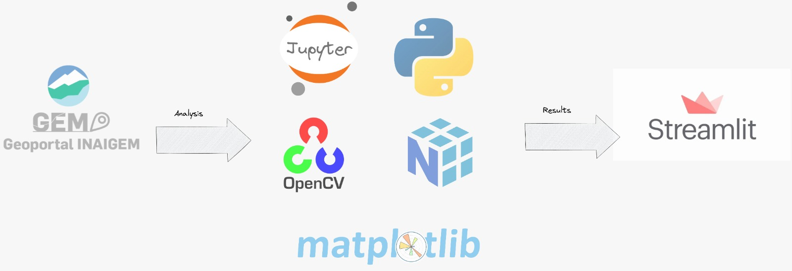
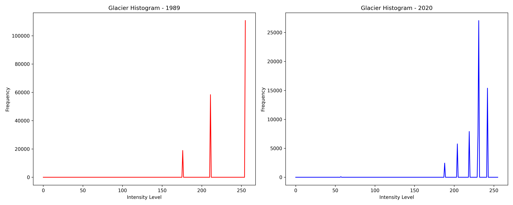

# Environmental Impact Analysis of Peruvian Glaciers using Computer Vision

### Overview

This project analyzes the environmental impact on glaciers across Peru using basic computer vision methodologies. Through histogram analysis, preprocessing, and visualization techniques, we quantify and visualize changes in glacier areas over time.


<div align="center">
    
</div>

**Data Source**: The glacier and mountain range images were obtained from the Geoportal INAIGEM website and saved locally for further analysis.


## Table of Contents
- [Project Features](#project-features)
- [Project Architecture](#project-architecture)
- [Technologies Used](#technologies-used)
- [Running the Application](#running-the-application)
- [Project Structure](#project-structure)
- [Usage Examples](#usage-examples)
- [Contributing](#contributing)
- [Contact](#contact)

## Project Features

- **Environmental Impact Assessment**: Visualize and quantify glacier changes at the national level in Peru.
- **Computer Vision Analysis**: Uses basic techniques such as histograms and color masking to analyze glacier boundaries.
- **Data Visualization**: Provides visual comparisons of glacier areas in 1989 and 2020 through images and histograms.


## Project Architecture

Below is the high-level architecture of the project, which includes data acquisition, preprocessing, analysis, and visualization stages. The images are initially obtained from the Geoportal INAIGEM, stored locally, and processed using OpenCV and Python.

 

1. **Data Collection**: Images of glaciers and mountain ranges are sourced from Geoportal INAIGEM.
2. **Data Storage**: Images are stored in the `data/` directory, categorized by mountain range and year.
3. **Preprocessing & Analysis**: Basic computer vision techniques (e.g., color filtering, edge detection) are applied to isolate and analyze glacier regions.
4. **Visualization**: The processed images and histograms are used to compare changes in glacier areas over time.
5. **Deploy**: In Streamlit, the analysis results are displayed.
---

## Technologies Used

- **Python**: Core programming language.
- **OpenCV**: For image processing and analysis.
- **Streamlit**: For creating an interactive web application.
- **Jupyter Notebooks**: For data exploration and code testing.
- **Geoportal INAIGEM**: Data source for glacier and mountain images.


## Running the Application

1. **Clone the Repository**:
   - First, clone the repository to your local machine:
     ```bash
     git clone https://github.com/Carlos93U/glacier_insight.git
     cd glacier_insight
     ```

2. **Install Dependencies**:
   - Install the required dependencies using `requirements.txt`:
     ```bash
     pip install -r requirements.txt
     ```

3. **Verify Data Processing**:
   - Navigate to the `notebooks/` directory and run the provided Jupyter notebooks to verify data preprocessing and analysis.

4. **Run the Streamlit Application**:
   - Start the app locally:
     ```bash
     streamlit run app.py
     ```
   - Access the application in your web browser at `http://localhost:8501`.


## Project Structure

The following is an overview of the main folders and files within the project.

```plaintext
glacier_insight/
│
├── data/                      # Directory for storing raw and processed images
│   ├── raw/                   # Raw images of glaciers by year
│   └── external/              # External figures
|── docs/                      # Docs for reference
│
├── notebooks/                 # Jupyter notebooks for data exploration and analysis
│
├── scripts/                   # Source code for image processing and analysis     
|
├── app.py                     # Streamlit application file
├── requirements.txt           # List of project dependencies
└── README.md                  # Project documentation

```

## Usage Examples

### Glacier Comparison

The application provides visual comparisons of glacier areas across various mountain ranges. Users can select a mountain range and view both the glacier comparison images and histograms for the years 1989 and 2020.

 

### Histogram Analysis

View histograms showing pixel intensity distributions, highlighting changes in glacier areas over time.



## Contributing

If you would like to contribute to the project, please fork the repository and create a pull request with your proposed changes. All contributions are welcome.


## Contact

For any questions or feedback, please contact:

**Juan C. Huillcas**  
Email: [huillcas.juan3@gmail.com](mailto:huillcas.juan3@gmail.com)  
LinkedIn: [Juan C. Huillcas](https://www.linkedin.com/in/juan-carlos-huillcas)  

---
